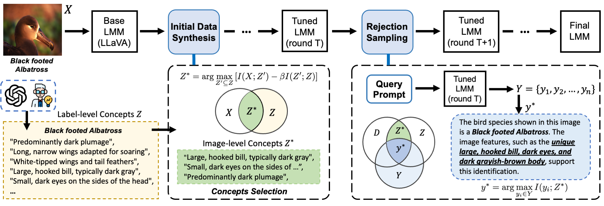

<div align="center">

<h1>Enhancing Cognition and Explainability of Multimodal Foundation Models</h1>
<h3>Self-Synthesized Data for Improved Visual Reasoning and Explanation</h3>

**Authors:** Yucheng Shi<sup>1</sup>, Quanzheng Li<sup>2</sup>, Jin Sun<sup>1</sup>, Xiang Li<sup>2</sup>, Ninghao Liu<sup>1</sup>  
<sup>1</sup>School of Computing, University of Georgia  
<sup>2</sup>Department of Radiology, Massachusetts General Hospital and Harvard Medical School  

[](https://openreview.net/forum?id=lHbLpwbEyt)
[](https://huggingface.co/YuchengShi)
[](https://github.com/sycny/SelfSynthX/blob/main/README.md)


*For questions, please contact [📧](mailto:yucheng.shi@uga.edu)*
</div>

This repository contains the code for our novel iterative visual fine-tuning framework that improves both the accuracy and explainability of Large Multimodal Models (LMMs). Our approach facilitates robust data generation and fine-tuning without relying on extensive manual annotations.



## Key Features

- 🧠 **Self-Synthesized Data Generation**: Automatic creation of interpretable training data using information bottleneck principle
- 🔄 **Iterative Fine-Tuning**: Progressive improvement through reward model-free rejection sampling
- 🔍 **Explainability Focus**: Produces human-verifiable explanations using domain-specific visual concepts
- 📊 **Multi-Domain Support**: Tested on biological, medical, and fine-grained visual classification tasks

## Overview
- **Source Code:** All core Python scripts are contained in the `src/` directory. These scripts handle data generation, model fine-tuning, evaluation, and other supporting tasks
- **Execution Pipeline:** The `run/IFT_RS.sh` shell script provides a step-by-step walk-through of the entire running logic—from data synthesis to iterative training
- **Evaluation:** We employ the [lmms-eval](./lmms-eval) framework to benchmark the general abilities of our model
- **Case Study:** Additional code is provided to replicate the application case study discussed in our paper

## Repository Structure

```
.
├── src/                        # Core Python scripts
│   ├── step1.1_desc_gen_vllm.py    # Generate image descriptions
│   ├── step1.2_concepts_gen.py      # Generate visual concepts
│   ├── step1.3_QA_gen_vllm.py      # Generate QA pairs
│   ├── stepx_llava_lora_save.py    # Save the fine-tuned LoRA model
│   ├── step2_llava_sft.py          # Main script for visual fine-tuning
│   ├── step2.1_batch_eval.py       # Batch evaluation of the model
│   ├── step2.5_ans_gen.py          # Generate answers using the fine-tuned model
│   ├── step2.6_ans_select.py       # Select the best answers from candidates
│   └── ...                         # Additional supporting scripts
├── run/
│   └── IFT_RS.sh              # Shell script orchestrating the full pipeline
├── lmms-eval/                 # Evaluation framework for assessing model capabilities
└── README.md                  # This file
```

## Getting Started

### Prerequisites

- Python 3.8+
- CUDA-enabled GPU is required for model training
- Accelerate & DeepSpeed: Our training scripts use the [Accelerate](https://huggingface.co/docs/accelerate/index) library along with DeepSpeed for distributed training
- Other Dependencies: Refer to `requirements.txt` for additional Python package requirements (e.g., PyTorch, transformers)

## Dataset

To set up the datasets required for training and evaluation, follow the instructions below for each dataset. Ensure that the datasets are placed in the appropriate directories as specified.

### FGVC Aircraft

- **Path:** `data/fgvc-aircraft-2013b`
- **Download Link:** [dataset link](https://www.robots.ox.ac.uk/~vgg/data/fgvc-aircraft/archives/fgvc-aircraft-2013b.tar.gz)
- **Instructions:**
  1. Download the dataset from the provided link.
  2. Extract the contents to the `data/fgvc-aircraft-2013b` directory.

### CUB-200-2011

- **Path:** `data/CUB_200_2011`
- **Download Link:** [dataset link](https://data.caltech.edu/records/20098)
- **Instructions:**
  1. Download the dataset from the provided link.
  2. Extract the contents to the `data/CUB_200_2011` directory.

### Stanford Dogs

- **Path:** `data/stanford_dogs`
- **Download Links:**
  - [Images](http://vision.stanford.edu/aditya86/ImageNetDogs/images.tar)
  - [Annotations](http://vision.stanford.edu/aditya86/ImageNetDogs/annotation.tar)
  - [Train/Test Split](http://vision.stanford.edu/aditya86/ImageNetDogs/lists.tar)
- **Instructions:**
  1. Download the images, annotations, and train/test split from the provided links.
  2. Extract the contents to the `data/stanford_dogs` directory.

### Additional Datasets

For other datasets used in this project, please follow similar steps to download and extract the datasets into the appropriate directories. Ensure that the paths are correctly set in the `run/IFT_RS.sh` script.

- `data/ham10000` - **TODO:** Provide download link and instructions.
- `data/chest_xray` - **TODO:** Provide download link and instructions.
- `data/pld` - **TODO:** Provide download link and instructions.


### Installation

1. **Clone the Repository**

```bash
git clone https://github.com/sycny/SelfSynthX.git
cd SelfSynthX
```

2. **Create a Virtual Environment with Conda (Optional)**

```bash
conda create -n vision python=3.10   
conda activate vision      
```

3. **Install Dependencies**

```bash
pip install -r requirements.txt
```

4. **Make Sure you have correctly Installed Accelerate and DeepSpeed**

Otherwise you need to manually swith to non-deepspeed version.

5. **Configure Paths**

Update the file paths in `run/IFT_RS.sh` (e.g., `model_path`, `retriever_path`, and `data_path`) to match your local setup.

## Running the Pipeline

The full execution pipeline is wrapped in the `IFT_RS.sh` script under the `run/` directory. This script executes the following steps:

1. **Initial Data Generation and Training (Round 1)**
   - Generate image descriptions, visual concepts, and QA pairs
   - Start initial fine-tuning using DeepSpeed with the `accelerate launch` command

2. **Iterative Training Rounds (Rounds 2, 3, and 4)**
   - Save intermediate models
   - Perform batch evaluations
   - Generate new answer candidates and apply selection
   - Execute further fine-tuning rounds with updated data

### How to Run

Execute the shell script with the following command:

```bash
bash run/IFT_RS.sh <dataset_name> <cuda_device_id>
```

This command will:
- Use the specified dataset (e.g., `my_dataset`)
- Set the CUDA device (e.g., GPU with ID 0)
- Automatically find an available port for training
- Run the iterative process for data synthesis and model fine-tuning

## Evaluation

The `lmms-eval` directory contains all the necessary scripts and configurations for evaluating the general performance of the fine-tuned model. For compatibility issues, we recommend to create a new conda environment and install the dependencies by running:

```bash
conda create -n lmms-eval python=3.10   
conda activate lmms-eval      
pip install -r lmms-eval/requirements.txt
```
And then you can benchmark on standard evaluation tasks by running:
```bash
bash lmms-eval/run.sh <dataset_name> <version> <cuda_device_id>
```

## Case Study

We provide a case study demonstrating how our method improves model explanations through iterative fine-tuning. As shown in Paper's Table 2, the fine-tuned model provides detailed, verifiable explanations:

- For plant disease identification, the model points out specific visual features like "brown or black necrotic spots" and their location "on the underside of the leaf"
- For bird classification, the model identifies key characteristics such as "bright red plumage" and "black mask around its eyes"
- The explanations align with expert-defined concepts and enable users to verify the model's reasoning

See `case_study/llava_conversation.py` for details.

## Citation

If you use this repository in your research, please consider citing our paper:

```bibtex
@inproceedings{
shi2025enhancing,
title={Enhancing Cognition and Explainability of Multimodal Foundation Models with Self-Synthesized Data},
author={Yucheng Shi and Quanzheng Li and Jin Sun and Xiang Li and Ninghao Liu},
booktitle={The Thirteenth International Conference on Learning Representations},
year={2025},
url={https://openreview.net/forum?id=lHbLpwbEyt}
}
```

## Contact

For any questions, suggestions, or issues, please open an issue on GitHub or contact us at [yucheng.shi@uga.edu](mailto:yucheng.shi@uga.edu).

Happy Researching & Coding!
